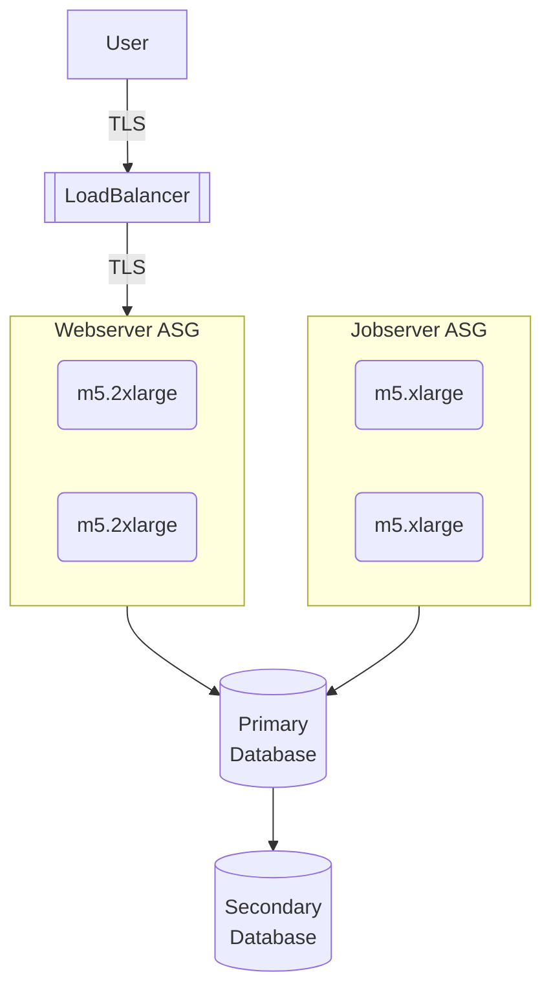

# Mermaid Diagram-as-code

## Two-tier layered architecture

```mermaid
flowchart TD
    User --TLS--> lb
    lb[[LoadBalancer]]   -- TLS --> webserver
    subgraph webserver [Webserver ASG]
        instance1(m5.2xlarge)
        instance2(m5.2xlarge)
    end
    subgraph jobserver [Jobserver ASG]
       instance3(m5.xlarge)
       instance4(m5.xlarge)
    end
    db1[(Primary\nDatabase)]
    db2[(Secondary\nDatabase)]
    webserver --> db1
    jobserver --> db1
    db1 --> db2
```

References

- [Mermaid JS Flowchart](https://mermaid.js.org/syntax/flowchart.html)
